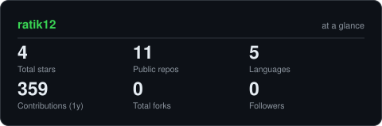
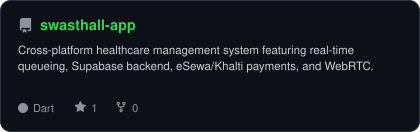
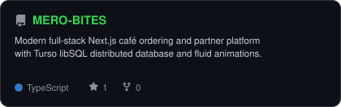
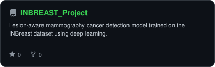
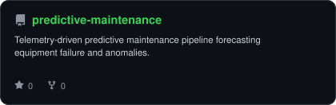

<div align="center">

<!-- ORIGINAL UNPIXELATED PHOTO -->


<br>

<!-- NAME / TAGLINE - animated typing (WHITE) -->
<a href="https://github.com/ratik12">
  
</a>

<br>

<!-- SOCIALS -->
<a href="https://www.linkedin.com/in/ratik-rauniyar-005ab5217"></a>
<a href="mailto:ratik.rauniyar@gmail.com"></a>
<a href="https://github.com/ratik12"></a>


</div>

---

## `~/` who am I?

```console
$ cat about.txt
```

Hi, I'm **Ratik Rauniyar**. I build machine learning pipelines, deep learning architectures, and scalable software systems.

- Currently building **[Swasthall](https://github.com/ratik12/swasthall-app)** and **[Mero Bites](https://github.com/ratik12/MERO-BITES)**
- Exploring **Deep Learning, Medical Computer Vision & MLOps**
- Focus: **Translating machine intelligence into real-world software**
- Fun fact: **01100010 01110101 01101001 01101100 01100100 (build)**

<br>

<div align="center">

## `~/` toolbox


</div>

---

<div align="center">

## `~/` skill radar

<table>
<tr>
<td width="50%" align="center" valign="middle">

<!-- Self-rated radar - edit assets/skills.json, the workflow redraws it -->
<picture>
  <source media="(prefers-color-scheme: dark)"  srcset="assets/radar-dark.svg">
  <source media="(prefers-color-scheme: light)" srcset="assets/radar-light.svg">
  
</picture>

</td>
<td width="50%" align="center" valign="middle">

<!-- Live radar built from real language byte counts across your repos -->
<picture>
  <source media="(prefers-color-scheme: dark)"  srcset="assets/radar-langs-dark.svg">
  <source media="(prefers-color-scheme: light)" srcset="assets/radar-langs-light.svg">
  
</picture>

</td>
</tr>
</table>

</div>

---

<div align="center">

## `~/` contribution calendar

<!-- 3D isometric calendar, regenerated every 6h by .github/workflows/metrics.yml -->


<br><br>

<!-- Snake eats the contribution graph - .github/workflows/snake.yml -->
<picture>
  <source media="(prefers-color-scheme: dark)"  srcset="https://raw.githubusercontent.com/ratik12/ratik12/output/snake-dark.svg">
  <source media="(prefers-color-scheme: light)" srcset="https://raw.githubusercontent.com/ratik12/ratik12/output/snake.svg">
  
</picture>

</div>

---

<div align="center">

## `~/` the numbers

<!-- Generated by scripts/cards.py into this repo. Deliberately NOT
     github-readme-stats / streak-stats / github-profile-trophy: those are
     shared public instances that go down and take the whole section with them. -->
<picture>
  <source media="(prefers-color-scheme: dark)"  srcset="assets/card-stats-dark.svg">
  <source media="(prefers-color-scheme: light)" srcset="assets/card-stats-light.svg">
  
</picture>

<br>


<br><br>


</div>

---

<div align="center">

## `~/` selected work

<!-- Cards generated by scripts/cards.py from assets/projects.json.
     Stars, forks and language are pulled live from the API on every run. -->
<table>
<tr>
<td width="50%">
  <a href="https://github.com/ratik12/swasthall-app">
    <picture>
      <source media="(prefers-color-scheme: dark)"  srcset="assets/card-swasthall-app-dark.svg">
      <source media="(prefers-color-scheme: light)" srcset="assets/card-swasthall-app-light.svg">
      
    </picture>
  </a>
</td>
<td width="50%">
  <a href="https://github.com/ratik12/MERO-BITES">
    <picture>
      <source media="(prefers-color-scheme: dark)"  srcset="assets/card-MERO-BITES-dark.svg">
      <source media="(prefers-color-scheme: light)" srcset="assets/card-MERO-BITES-light.svg">
      
    </picture>
  </a>
</td>
</tr>
<tr>
<td width="50%">
  <a href="https://github.com/ratik12/INBREAST_Project">
    <picture>
      <source media="(prefers-color-scheme: dark)"  srcset="assets/card-INBREAST_Project-dark.svg">
      <source media="(prefers-color-scheme: light)" srcset="assets/card-INBREAST_Project-light.svg">
      
    </picture>
  </a>
</td>
<td width="50%">
  <a href="https://github.com/ratik12/predictive-maintenance">
    <picture>
      <source media="(prefers-color-scheme: dark)"  srcset="assets/card-predictive-maintenance-dark.svg">
      <source media="(prefers-color-scheme: light)" srcset="assets/card-predictive-maintenance-light.svg">
      
    </picture>
  </a>
</td>
</tr>
</table>

<sub>

| project | category | stack |
|---|---|---|
| **[swasthall-app](https://github.com/ratik12/swasthall-app)** | Healthcare & Queueing App | `Flutter` `Supabase` `TypeScript` `WebRTC` |
| **[MERO-BITES](https://github.com/ratik12/MERO-BITES)** | Commerce & Ordering Platform | `Next.js 16` `React 19` `Tailwind CSS` `Turso` |
| **[INBREAST_Project](https://github.com/ratik12/INBREAST_Project)** | Cancer Detection ML | `Python` `Deep Learning` `PyTorch` |
| **[predictive-maintenance](https://github.com/ratik12/predictive-maintenance)** | Predictive Telemetry | `Python` `Machine Learning` `Pandas` |

</sub>

</div>

---

<div align="center">

<sub>`01110100 01101000 01100001 01101110 01101011 01101111 01110101 00100000 01100110 01101111 01110010 00100000 01110011 01100011 01110010 01101111 01101100 01101100 01101001 01101110 01100111`</sub>

</div>
